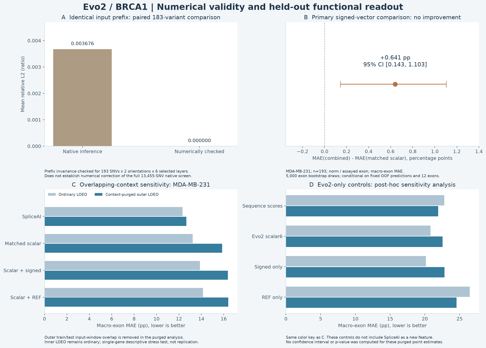
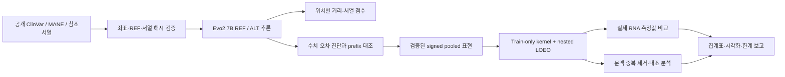

# Evo2 BRCA1 Variant Analysis

**Evo2 7B의 BRCA1 변이 유도 표현을 수치적으로 검증하고, 스플라이싱 기능값과의 관계를 평가한 연구 프로젝트**

> BRCA1 variant representation analysis with numerical quality control, train-only kernel probes, and context-overlap sensitivity checks.

Evo2의 REF·ALT 서열 점수와 위치별 표현 차이를 분석한다. 32k 문맥에서 동일한 입력 앞부분에 나타난 계산상 차이를 추적하고, 수치 검증을 통과한 별도 집합에서 signed 표현의 기능 예측력을 평가했다. 이 저장소는 연구 핵심 코드와 검증 가능한 집계 결과를 선별한 공개본이다. Evo2 모델·추론 엔진은 [Arc Institute의 공식 프로젝트](https://github.com/ArcInstitute/evo2)를 사용한다.



## 1. 연구 범위와 확인된 결과

| 항목 | 기록된 결과 | 해석 범위 |
|---|---|---|
| 원래 BRCA1 스크리닝 | 13,455 SNV, 32,768 bp 문맥 | native 추론 기록. 전체의 수치 교정 완료를 의미하지 않음 |
| 별도 수치 검증 집합 | SeqSplice 193 SNV × 2방향 = 386 variant views | 6개 선택 레이어·5개 pooling 영역 |
| 동일 prefix 검사 | 2,316개 선택 레이어 검사 통과 | 386 views × 6 layers |
| REF 반복 대조 | 288개 서로 다른 REF 대조 | 반복 대조와 REF–ALT prefix 검사를 구분 |
| 주 기능 비교 | macro-exon MAE 13.237234 → 13.877791 pp | MDA-MB-231, norm / assayed exon, n=193 |
| 주 효과 | ΔMAE = +0.640557 pp, 95% CI [0.143424, 1.103266] | signed 표현 추가로 주 비교가 개선되지 않음 |
| 문맥 중복 제거 | outer train/test window overlap 0 | 단일 유전자 내 기술적 민감도 분석; 독립 재현이 아님 |
| 단일 GPU 길이 실험 | 40,960 bp 3회 성공, 41,984 bp 2회 OOM | 기록된 RTX 6000 Ada 48GB 설정의 경계. 모델 자체의 최대 문맥이 아님 |

주 효과의 원래 값은 [signed_primary_effect.json](docs/results/signed_primary_effect.json)에 보존했다. 구간은 12개 엑손의 고정된 OOF 예측에 대한 5,000회 bootstrap이며, 재학습·튜닝 불확실성을 모두 포함하지 않는다. 두 세포주는 변이를 공유하므로 독립 변이 재현 집합으로 해석하지 않는다.

## 2. 구현한 내용



- **입력 검증:** GRCh38 변이·참조 염기·전사체·역상보 좌표·서열 해시 관리.
- **추론 계측:** 재개 가능한 BRCA1 스크리닝, REF/ALT 임베딩, 위치별 상대 L2·cosine·RMS, 입력 길이와 OOM 측정.
- **수치 진단:** FFT 반올림 경로, HCM 직접 FP32 / HCL FP64 대조, 동일 prefix 및 REF 반복 검사.
- **기능 평가:** 학습 fold에만 맞추는 중심화·정규화, dual kernel ridge, nested leave-one-exon-out, 같은 위치 ALT 묶음 유지, 독립 direct solve 대조.
- **민감도 분석:** 겹치는 32k 문맥 제거, REF·unit-direction·duplicate-kernel 대조, SpliceAI를 포함한 기준과 Evo2-only 기준의 구분.

수치 검증 성공과 생물학적 예측 성능 개선은 별도 결과다. 동일 prefix의 계산 오차를 기능 신호로 해석하지 않으며, native 전체 스크리닝과 교정된 193개 집합의 점수·순위를 섞지 않는다. [실험 해석](docs/RESULTS.md)에 세부 범위를 설명했다.

## 3. GPU 없이 확인하기

Python 3.11 또는 3.12의 별도 가상환경에서:

```bash
python -m venv .venv-analysis
# Windows: .venv-analysis\Scripts\Activate.ps1
# Linux/macOS: source .venv-analysis/bin/activate
python -m pip install -r requirements-analysis.txt
python -m pytest -q
python scripts/analysis/brca1_signed_kernel.py
python scripts/reporting/render_portfolio_results.py --output runs/figures
```

이 명령은 공개 집계값의 해시·일관성과 합성 수학 대조를 확인하고, 기록된 결과로 그림을 다시 만든다. 모델 다운로드·GPU 재추론은 하지 않는다. Linux에서는 기존 분석의 두 경계 테스트도 실행할 수 있다.

```bash
python -m unittest discover -s scripts/analysis -p test_brca1_analysis.py
```

## 4. GPU 추론 코드 재사용

원래 추론 환경은 Linux x86_64 / Python 3.12 / PyTorch 2.7.1 CUDA 12.8 / Evo2 0.6.0 / Flash Attention 2.8.0.post2였다. `env.sh`와 `setup.sh`는 프로젝트 내부 환경을 구성한다. **setup은 GPU 패키지를 설치하며 첫 모델 실행은 별도의 대용량 가중치가 필요하다.** 이번 공개 정리에서는 설치 스크립트나 GPU 실험을 다시 실행하지 않았다.

```bash
bash setup.sh
source env.sh
python scripts/inference/infer_minimal.py --sequence ACGT
```

전체 BRCA1 재현에는 참조 FASTA, 고정된 ClinVar/MANE 입력, cohort manifest, 측정값, 수치 audit, activation 파일이 추가로 필요하다. 이 저장소에 모두 포함된 것이 아니다. [재현 수준과 필요한 입력](docs/REPRODUCING.md)을 먼저 확인한다. 스크립트가 audit·fingerprint 불일치로 중단되면 검증 조건을 제거하지 말고 입력과 실행 환경을 다시 맞춘다.

## 5. 코드와 자료

| 경로 | 역할 |
|---|---|
| [scripts/inference](scripts/inference/) | 입력 준비, 추론·임베딩, 수치 진단, signed layer 추출 |
| [scripts/analysis](scripts/analysis/) | 집계·kernel·기능 평가·context-purged 대조 |
| [scripts/reporting](scripts/reporting/) | 공개 집계 기반 결과 그림 재생성 |
| [docs/results](docs/results/) | 실제 기록의 작은 CSV·JSON과 검증 요약 |
| [docs/SOURCE_FILES.json](docs/SOURCE_FILES.json) | 원본 상대 경로·SHA-256·공개 파일 SHA-256·변환 내역 |
| [VALIDATION.md](VALIDATION.md) | 이번 공개 준비에서 실제 수행한 검증 |
| [docs/STATUS.md](docs/STATUS.md) | 완료 범위·남은 보완·연구 한계 |
| [SECURITY.md](SECURITY.md) | 공개 범위와 비밀정보 제외 정책 |

모델 가중치, 전체 임베딩·NPZ, 원시 VCF/FASTA, 개인 설정, API 키, 내부 주소, 실행 로그, 자동 감시·계정 관리 코드는 공개하지 않는다. 원래 작업 폴더와 기존 실험 결과는 수정하지 않았다.

## 6. 출처와 사용 범위

[Evo2 / Arc Institute](https://github.com/ArcInstitute/evo2), [ClinVar / NCBI](https://www.ncbi.nlm.nih.gov/clinvar/), [MANE / NCBI](https://www.ncbi.nlm.nih.gov/refseq/MANE/)를 기반으로 한 연구 코드다. [EVEE](https://www.goodfire.com/research/evee-explaining-genetic-variants)의 표현 기반 변이 분석과 겹치는 범위를 고려하며, 단순 REF–ALT 표현 분석 자체를 새로운 방법이라고 주장하지 않는다.

이 저장소는 연구용이며 임상 진단·환자별 위험 판정용으로 검증되지 않았다. 기반 모델·외부 데이터·도구의 이용 조건은 원 출처를 따른다. 이 프로젝트 코드에 대한 별도 오픈소스 재사용 라이선스는 아직 부여하지 않았다.
